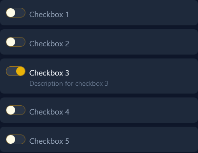
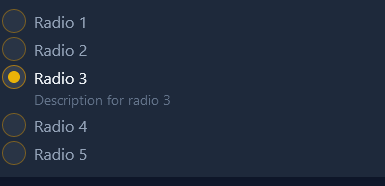

# Form Components

## Select

#### Without label
```bladehtml
<x-p-select>
    <option>...</option>
</x-p-select>
```

#### With label text
```bladehtml
<x-p-select label="Label text">
    <option>...</option>
</x-p-select>
```

#### With empty label
```bladehtml
<x-p-select label="">
    <option>...</option>
</x-p-select>
```

#### Placeholder
You can add placeholder (selected and disabled by default).
```bladehtml
<x-p-select placeholder="Select value">
    <option>...</option>
</x-p-select>
```


#### Select styling
Use `class` attribute to add tailwind classes.
If you want to style label pass `label-classes` to `<x-p-select />`.


## Checkbox
```bladehtml
<x-p-checkbox label="Checkbox" description="Some optional description"/>
```


## Switch (checkbox)
```bladehtml
<x-p-checkbox asSwitch label="Switch" description="Some optional description"/>
```


## Radio
```bladehtml
<x-p-radio name="someName" value="someValue1" label="Radio" description="Some optional description"/>
```

