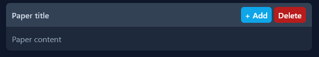

# Paper



## Code example for paper-component:
```
<x-p-paper>
    // content goes here
</x-p-paper>        
```
If you want to change default background color use exclamation mark `!` before class name.

## Code example for paper-component with title:
Page title should be passed into `<x-slot:title/>` component.
```
<x-p-paper>
    <x-slot:title>Page title</x-slot:title>
</x-p-paper-title>        
```

## Code example for paper-component with title and actions:
You can pass some action(s) into title bar. Pass all your title bar actions into `<x-slot:actions />` component 
```
 <x-p-paper>
    <x-slot:title>Paper title</x-slot:title>
    <x-slot:actions class="lowercase">
        <x-p-button color="info" class="rounded-md">+ Add</x-p-button>
        <x-p-button color="danger" class="rounded-md">Delete</x-p-button>
    </x-slot:actions>
    
    Paper content
    
</x-p-paper>     
```
